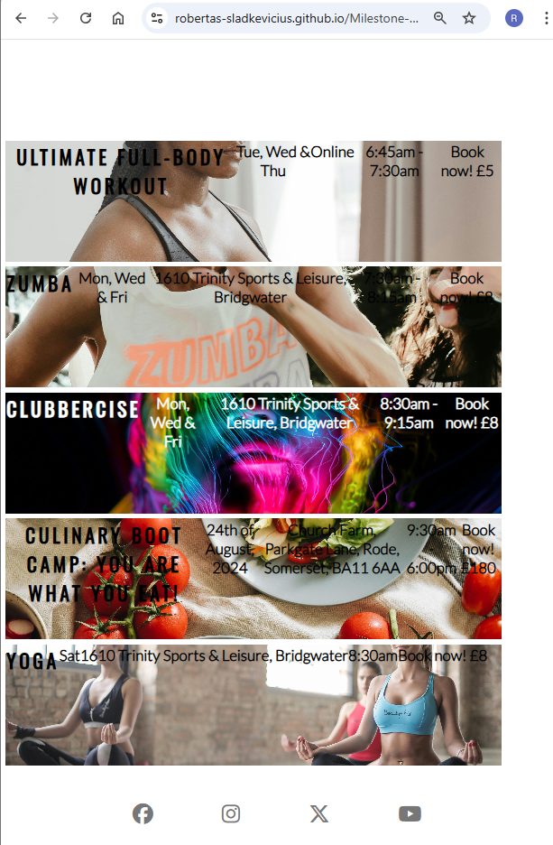

# Milestone Project 1 – Don't Stop Exercise (DSE)

---

## Overview

- Milestone Project 1
- City of Bristol College
- Web Development Applications
- Project name: Don't Stop Exercise (DSE)
- Project purpose: promote a healthy lifestyle

---

## Live Site

- https://Robertas-Sladkevicius.github.io/Milestone-Project-1/

---

## User Experience (UX)

### User Goals

- Understand available fitness services
  

- View exercise classes
- Browse activity images
- Sign up for a free trial session

### Site Owner Goals

- Promote fitness programs
- Encourage sign-ups
- Provide clear information
- Maintain professional presentation

---

## Features

- Responsive navigation menu
- Hero section with call-to-action
- Exercise class listings
- Image gallery
- Sign-up form with validation
- Social media links

---

## Technologies Used

- HTML5
- CSS3
- Font Awesome
- Google Fonts
  - Oswald
  - Lato
- GitHub Pages

---

## Project Structure

text
.
├── index.html
├── gallery.html
├── sign_up.html
├── README.md
└── assets
    ├── css
    │   └── style.css
    ├── img
    │   └── website images
    └── readme
        └── README screenshots
## Screenshots

- Home Page
- Gallery Page
- Sign-Up Page

---

## Setup

- Clone repository
  bash
- Clone the repository
    -bash
    -git clone https://github.com/Robertas-Sladkevicius/Milestone-Project-1.git
  - Navigate to project directory
    -bash
    -cd Milestone-Project-1
- Open project
  - Open `index.html` in a web browser

## Deployment

- Platform
  - GitHub Pages

- Steps
  - Open repository on GitHub
  - Go to Settings
  - Select Pages
  - Configure deployment
    - Source: Deploy from a branch
    - Branch: Milestone-Project-1
    - Folder: /(root)
  - Save changes
  - Open live site URL

## Testing & Debugging

- Testing
  - Navigation links tested
  - Image loading tested
  - Form validation tested
  - Desktop layout tested
  - Tablet layout tested
  - Mobile layout tested

- Validation Tools
  - Google Chrome DevTools
  - W3C HTML Validator
  - W3C CSS Validator

- Issues Fixed
  - Incorrect image paths
  - Incorrect CSS paths
  - Broken media queries
  - Case-sensitive filename issues
  - Incorrect folder structure

## Credits

- Code Institute
  - Project guidance
  - Form background image
- Pexels
  - Royalty-free images
- Font Awesome
  - Icons
- Google Fonts
  - Oswald
  - Lato

## License

- MIT License

  
